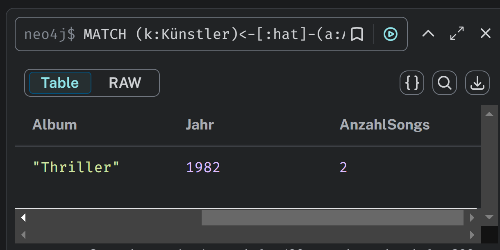

# KN-N02

Erklärung des Statements:

```cypher
MATCH (n)
OPTIONAL MATCH (n)-[r]-()
RETURN n, r
MATCH (n): // Sucht alle Knoten im Graphen.
```

OPTIONAL MATCH (n)-[r]-(): Sucht nach Beziehungen der Knoten, gibt aber auch Knoten ohne Beziehungen zurück.

Wichtig:
OPTIONAL MATCH zeigt auch Knoten ohne Beziehungen, während MATCH nur Knoten mit Beziehungen zeigt.

---

1. Finde alle deutschen Künstler mit ihren Alben und den enthaltenen Songs
Szenario: Ein Musikanalyse-Tool möchte alle Informationen über deutsche Künstler, ihre Alben und die dazugehörigen Songs für eine Analyse der deutschen Musikszene sammeln.
```cypher
MATCH (k:Künstler)-[r1:hat]-(a:Album)-[r2:enthält]->(s:Song)
WHERE k.Land = "Deutschland"
RETURN k.Name AS Künstler, a.Titel AS Album, a.Jahr AS Jahr, s.Titel AS Song, s.Dauer AS Dauer
ORDER BY a.Jahr, s.Tracknummer
```


2. Finde alle Playlists, die Songs enthalten, die länger als 4 Minuten sind
Szenario: Ein Streaming-Dienst möchte Nutzer identifizieren, die längere Songs bevorzugen, indem er Playlists analysiert, die Songs mit einer Dauer von mehr als 4 Minuten enthalten.

```cypher
MATCH (p:Playlist)-[r:referenziert]->(s:Song)
WHERE s.Dauer > 4.0
RETURN p.Name AS Playlist, p.Erstellungsdatum AS Erstellt, 
       collect(s.Titel) AS Songs, 
       count(s) AS AnzahlLangerSongs
ORDER BY AnzahlLangerSongs DESC
```


3. Finde alle Künstler und ihre Alben aus den 80er Jahren mit der Anzahl der Songs
Szenario: Ein Musikhistoriker untersucht die Produktivität von Künstlern in den 80er Jahren und möchte die Anzahl der Songs pro Album für diese Ära ermitteln.

```cypher
MATCH (k:Künstler)<-[:hat]-(a:Album)-[:enthält]->(s:Song)
WHERE a.Jahr >= 1980 AND a.Jahr < 1990
RETURN k.Name AS Künstler, k.Land AS Land, a.Titel AS Album, a.Jahr AS Jahr,
       count(s) AS AnzahlSongs
ORDER BY a.Jahr
```



4. Finde alle Playlists, die Songs aus verschiedenen Genres enthalten
Szenario: Ein Musikmarketingteam möchte Nutzer mit vielseitigem Musikgeschmack identifizieren, indem es Playlists mit Songs aus unterschiedlichen Genres analysiert.

```cypher
MATCH (p:Playlist)-[:referenziert]->(s:Song)<-[:enthält]-(a:Album)
WITH p, collect(DISTINCT a.Genre) AS Genres
WHERE size(Genres) > 1
RETURN p.Name AS Playlist, p.Erstellungsdatum AS Erstellt, Genres AS EnthaltendeGenres,
       size(Genres) AS AnzahlGenres
ORDER BY AnzahlGenres DESC
```


---

1. Ohne Detach - Löschen eines Albums mit bestehenden Beziehungen
Dieses Statement wird wahrscheinlich fehlschlagen, da das Album "Thriller" Beziehungen zu Künstlern und Songs hat.

```cypher
MATCH (a:Album {Titel: "Thriller"})
DELETE a
```

2. Mit Detach - Löschen eines Albums mit allen seinen Beziehungen:
Dieses Statement wird erfolgreich sein. Es löscht sowohl das Album "Thriller" als auch alle seine eingehenden und ausgehenden Beziehungen.

```cypher
MATCH (a:Album {Titel: "Thriller"})
DETACH DELETE a
```


---

1. Künstlergenre aktualisieren und auf alle Alben übertragen
Szenario: Ein Musikverlag hat seine Genrekategorisierung aktualisiert und möchte nun das Genre eines Künstlers ändern und diese Änderung gleichzeitig auf alle seine Alben übertragen.

```cypher
MATCH (k:Künstler {Name: "Michael Jackson"})-[:hat]-(a:Album)
SET k.Genre = "Industrial Metal", a.Genre = "Industrial Metal"
RETURN k.Name AS Künstler, k.Genre AS NeuesGenre, collect(a.Titel) AS AktualisierteAlben
```


2. Playlists zusammenführen
Szenario: Ein Nutzer möchte zwei seiner Playlists zusammenführen, sodass alle Songs der einen Playlist auch in der anderen enthalten sind, ohne Duplikate zu erzeugen.

```cypher
MATCH (zielPlaylist:Playlist {Name: "Workout Mix"}), (quellPlaylist:Playlist {Name: "Meine Lieblingslieder"})
MATCH (quellPlaylist)-[:referenziert]->(s:Song)
MERGE (zielPlaylist)-[:referenziert]->(s)
SET zielPlaylist.Name = "Ultimate Mix"
RETURN zielPlaylist.Name AS NeuerName, count(s) AS GesamtAnzahlSongs
```


3. Albumjahr anhand historischer Daten korrigieren und Beziehung ändern
Szenario: Ein Musikhistoriker hat festgestellt, dass das Veröffentlichungsjahr eines klassischen Albums falsch ist und möchte das Jahr korrigieren sowie die Beziehung zu einem anderen Künstler ändern.

```cypher
MATCH (a:Album {Titel: "MATHEMATIC-RAPADDICT"})-[r:hat]->(k:Künstler)
MATCH (neuerKünstler:Künstler {Name: "Michael Jackson"})
DELETE r
CREATE (a)-[:hat {Quelle: "Historische Korrektur"}]->(neuerKünstler)
SET a.Jahr = 1791, a.Anmerkung = "Datum historisch verifiziert"
RETURN a.Titel AS Album, a.Jahr AS KorrigiertesJahr, neuerKünstler.Name AS KorrigierterKünstler
```


---

1. WHERE – Um genauer zu filtern
Erklärung:
Mit WHERE kann man sagen: „Ich will nur bestimmte Ergebnisse.“ Zum Beispiel nur Spieler, die älter als 18 sind.

Beispiel:

```cypher
MATCH (p:Person)
WHERE p.age > 18
RETURN p.name, p.age;
```

Was macht das?
Gibt alle Personen zurück, die älter als 18 sind.

2. ORDER BY – Ergebnisse sortieren
Erklärung:
Mit ORDER BY kann man festlegen, in welcher Reihenfolge Ergebnisse angezeigt werden – z. B. von jung nach alt.

Beispiel:

```cypher
MATCH (p:Person)
RETURN p.name, p.age
ORDER BY p.age ASC;
```

Was macht das?
Zeigt alle Personen, sortiert nach Alter – die Jüngsten zuerst.