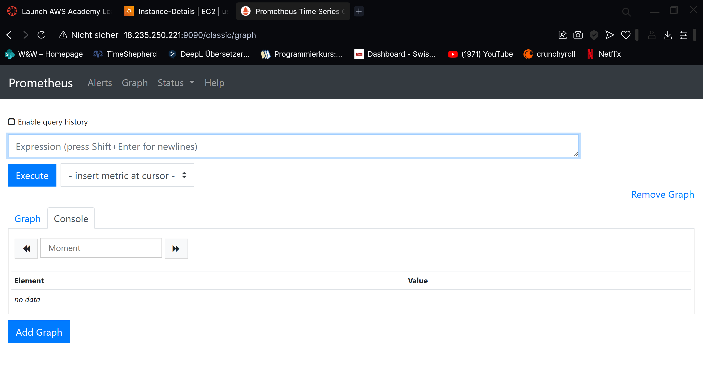

# KN-P01





## 1. Was sind Scrapes?
Scrapes in Prometheus bezeichnen den Prozess des Sammelns von Metrikdaten von verschiedenen Zielen in festgelegten Intervallen. Es ist der aktive Vorgang, bei dem Prometheus HTTP-Anfragen an die sogenannten "Targets" (Ziele) sendet, um deren Metriken abzurufen.
Wie funktioniert das Scraping:

Prometheus agiert als "Pull-System" - es fragt aktiv Metriken von Zielsystemen ab, anstatt dass diese Systeme Daten an Prometheus senden
Jede Zielanwendung stellt einen HTTP-Endpunkt (normalerweise /metrics) bereit, der strukturierte Metriken zurückgibt
Prometheus ruft diese Endpunkte in regelmäßigen Abständen auf und speichert die Daten in seiner Zeitreihendatenbank

Konkrete Beispiele aus der Konfigurationsdatei:
```yaml
global:
  scrape_interval: 15s  # Das globale Intervall für alle Scrapes
scrape_configs:
  - job_name: prometheus  # Scrape-Job für Prometheus selbst
    static_configs:
      - targets: ['localhost:9090']  # Ziel-URL für Scraping
  - job_name: node  # Scrape-Job für Node Exporter
    static_configs:
      - targets: ['localhost:9100']  # Ziel-URL für Scraping
In diesem Beispiel werden zwei Jobs definiert:
```

prometheus - sammelt Metriken von Prometheus selbst (Selbstüberwachung)
node - sammelt Systemmetriken vom Node Exporter (CPU, Speicher, Festplatte, etc.)

---

## 2. Was sind Rules?
Rules (Regeln) in Prometheus sind vordefinierte Ausdrücke, die regelmäßig ausgewertet werden, um entweder neue Metriken zu berechnen oder Alarme auszulösen. Es gibt zwei Haupttypen:

Recording Rules: Berechnen vorausberechnete Ausdrücke und speichern das Ergebnis als neue Metrik
Alerting Rules: Lösen Alarme aus, wenn bestimmte Bedingungen erfüllt sind

Konkrete Beispiele aus der Konfigurationsdatei:
Recording Rules:
```yaml
- record: node_memory_MemFree_percent
  expr: 100 - (100 * node_memory_MemFree_bytes / node_memory_MemTotal_bytes)
- record: node_filesystem_free_percent
  expr: 100 * node_filesystem_free_bytes{mountpoint="/"} / node_filesystem_size_bytes{mountpoint="/"}
```
Diese beiden Recording Rules:

1. Berechnen den prozentualen Speicherverbrauch (als node_memory_MemFree_percent)
2. Berechnen den prozentualen freien Festplattenplatz am Root-Mountpoint (als node_filesystem_free_percent)

Alerting Rules:
```yaml
- alert: InstanceDown
  expr: up == 0
  for: 1m
  labels:
    serverity: critical
  annotations:
    summary: "Instance {{ $labels.instance }} down"
    description: "Instance {{ $labels.instance }} of job {{ $labels.job }} has been down for more than 1 minute."
```

Diese Alerting Rule:

1. Überwacht, ob eine Instanz nicht mehr erreichbar ist (up == 0)
2. Wartet eine Minute, bevor der Alarm ausgelöst wird
3. Kennzeichnet den Alarm als "kritisch"
4. Fügt zusammenfassende Informationen über die ausgefallene Instanz hinzu

---

## 3. Schritte zum Speichern eigener Daten in Prometheus
Um eigene Daten in Prometheus zu speichern, müssen Sie folgende Schritte ausführen:

1. Exporter oder Instrumentierung bereitstellen:
    - Entweder einen existierenden Exporter verwenden (wie Node Exporter für Systemmetriken)
    - Oder Ihre eigene Anwendung mit einer Prometheus-Client-Bibliothek instrumentieren


2. Metriken definieren:
    - Identifizieren Sie die zu messenden Werte (Counter, Gauge, Histogram, Summary)
    - Benennen Sie Metriken nach Prometheus-Konventionen (z.B. http_requests_total)
    - Definieren Sie sinnvolle Labels zur Kategorisierung (z.B. status="200", method="GET")


3. HTTP-Endpunkt einrichten:
    - Implementieren Sie einen HTTP-Endpunkt (üblicherweise /metrics)
    - Stellen Sie sicher, dass der Endpunkt im Prometheus-Textformat antwortet


4. Prometheus-Konfiguration aktualisieren:
    - Fügen Sie einen neuen Job in der scrape_configs Sektion hinzu
    - Definieren Sie das Target (Host)
    - Optional: Setzen Sie job-spezifische Einstellungen


5. Optional: Recording Rules definieren:
    - Wenn Sie häufig komplexe Abfragen durchführen, erstellen Sie Recording Rules
    - Fügen Sie diese in die rules.yml Datei ein


6. Prometheus neu laden:
    - Laden Sie die Prometheus-Konfiguration neu (POST /api/-/reload oder SIGHUP)


Beispiel für eine neue Anwendung in der Prometheus-Konfiguration:
```yaml
yamlKopierenscrape_configs:
  - job_name: meine_anwendung
    static_configs:
      - targets: ['localhost:8080']
    metrics_path: /metrics
    scrape_interval: 10s
```

---

## 4. Verwendete Variablen in Scrapes und Rules
Variablen in Scrapes:
- scrape_interval: 15s - Definiert das globale Abrufintervall
- job_name - Identifiziert jeden Scrape-Job
- targets - Spezifiziert Host und Port der abzufragenden Systeme

Variablen in Rules:
- node_memory_MemFree_bytes - Speicher-Metrik vom Node Exporter
- node_memory_MemTotal_bytes - Speicher-Metrik vom Node Exporter
- node_filesystem_free_bytes - Dateisystem-Metrik vom Node Exporter
- node_filesystem_size_bytes - Dateisystem-Metrik vom Node Exporter
- up - Interne Prometheus-Metrik für die Verfügbarkeit von Targets
- $labels.instance und $labels.job - Template-Variablen für Instanznamen und Job-Namen

Herkunft der Variablen:
- node_* Metriken stammen vom Node Exporter (localhost:9100)
- up wird von Prometheus selbst für jedes Target erzeugt
- Die $labels.* Variablen werden während der Auswertung einer Rule von Prometheus selbst befüllt

URLs für diese Variablen:

- http://localhost:9100/metrics - Node Exporter Metriken
- http://localhost:9090/metrics - Prometheus-eigene Metriken

---

## 5. Wie erkennt Prometheus, ob ein System up ist
Prometheus erzeugt automatisch eine spezielle Metrik namens up für jedes konfigurierte Target. Diese Metrik hat zwei mögliche Werte:

- 1: Das Target ist erreichbar und liefert Metriken
- 0: Das Target ist nicht erreichbar oder liefert keine gültigen Metriken

Der Prozess funktioniert so:
1. Bei jedem Scrape-Vorgang versucht Prometheus, den HTTP-Endpunkt des Targets zu erreichen
2. Wenn der HTTP-Request erfolgreich ist und gültige Metriken zurückgibt, setzt Prometheus up = 1
3. Bei einem Timeout, Verbindungsfehler oder ungültigen Daten setzt Prometheus up = 0

In der Alerting Rule wird diese Metrik verwendet:
```yaml
- alert: InstanceDown
  expr: up == 0
  for: 1m
```

Diese Regel prüft, ob die up-Metrik für ein Target den Wert 0 hat, was bedeutet, dass das System nicht erreichbar ist. Die for: 1m Klausel sorgt dafür, dass der Alarm erst ausgelöst wird, wenn das Target für mindestens eine Minute nicht erreichbar war, was kurzfristige Netzwerkprobleme ignoriert.
Diese Überwachung ist vollständig automatisch und benötigt keine zusätzliche Konfiguration, sobald ein Target in den scrape_configs definiert wurde.