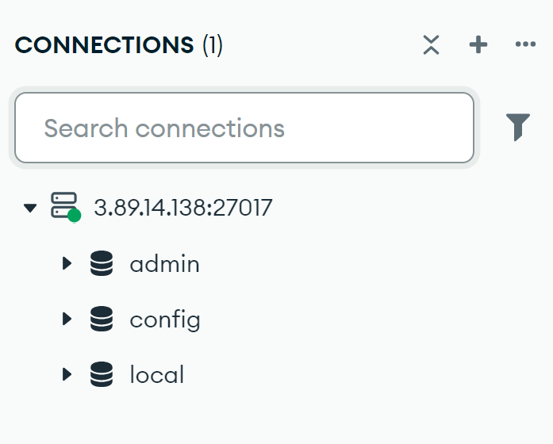
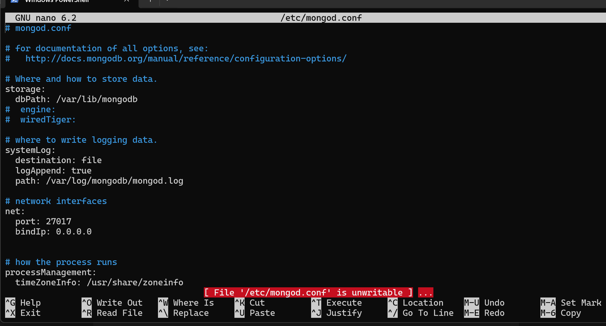
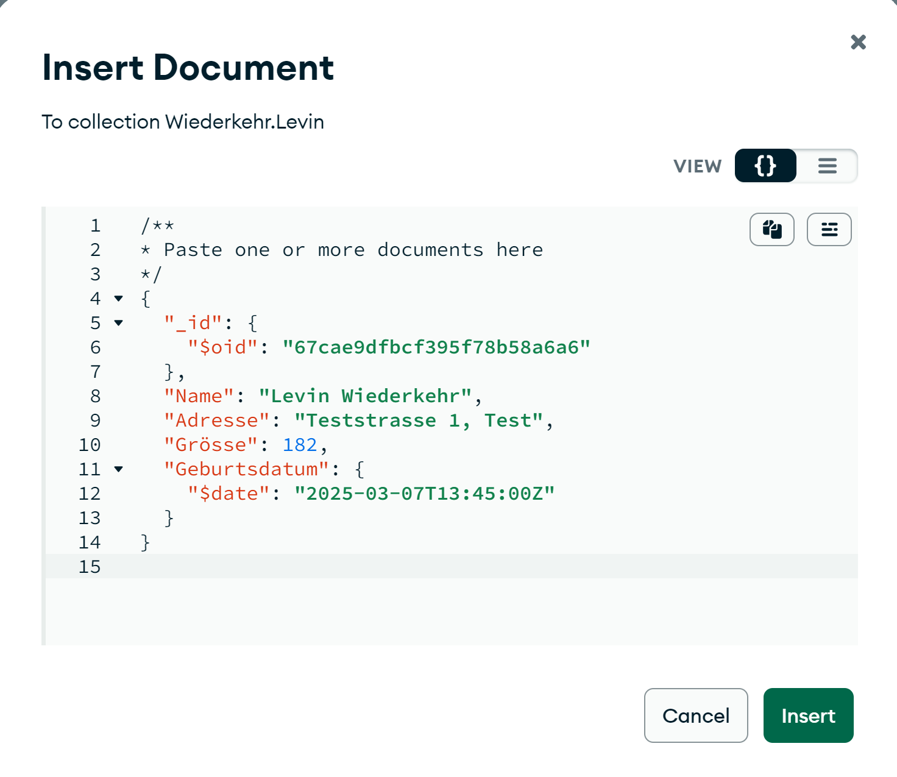
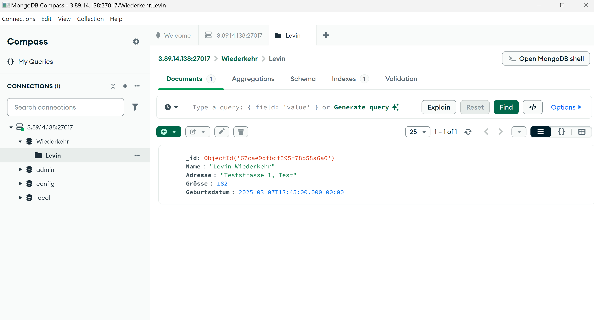
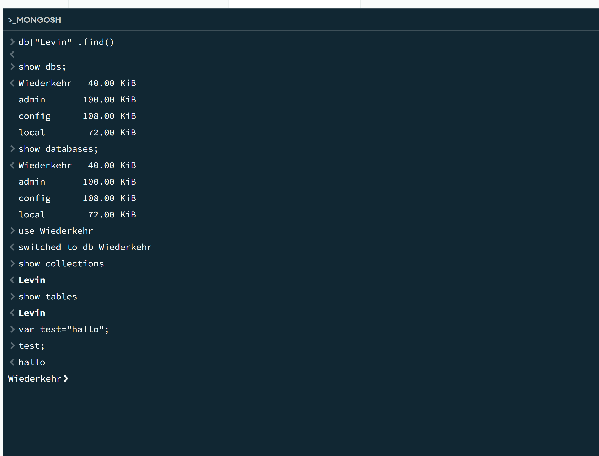
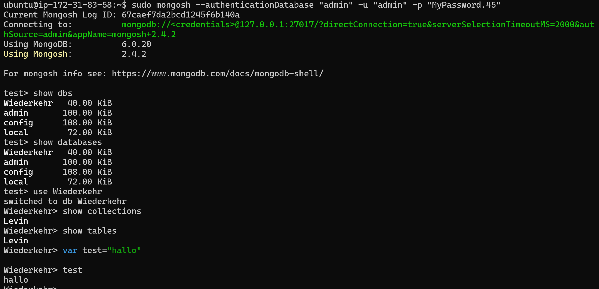

# KN01

## authSource=admin
Die Option authSource=admin gibt an, dass die admin-Datenbank für die Benutzer-Authentifizierung verwendet wird. Dies ist korrekt, da die admin-Datenbank in MongoDB standardmäßig für die Verwaltung von Benutzerrollen und -berechtigungen genutzt wird.

## sed-Befehl
Der Befehl sed wird verwendet, um Text in einer Datei zu suchen und zu ersetzen. In Bezug auf MongoDB wird er verwendet, um Konfigurationswerte wie bind_ip und port anzupassen. Zum Beispiel ersetzt sed bind_ip: 127.0.0.1 durch bind_ip: 0.0.0.0, damit MongoDB von anderen IPs erreichbar ist. Ebenso kann sed den Standardport von 27017 auf einen anderen Wert ändern, um den Zugriff zu steuern.

Ich musst den Datentyp nicht ändern, bei mir war es direkt alsd Datum gespeichert.

## Bedeutung der Befehle
1. show dbs; / show databases; → Zeigt alle vorhandenen Datenbanken.
2. use Ihre-Datenbank; → Wechselt zur angegebenen Datenbank (Groß-/Kleinschreibung beachten).
3. show collections; / show tables; → Zeigt alle Collections der aktuellen Datenbank.
4. var test = "hallo"; test; → Erstellt eine Variable und gibt deren Wert aus.

## Unterschied zwischen Collections und Tables
- Collection (MongoDB) → JSON-Dokumente, flexible Struktur, kein fixes Schema.
- Table (SQL) → Zeilen & Spalten, festes Schema, strukturierte Daten.