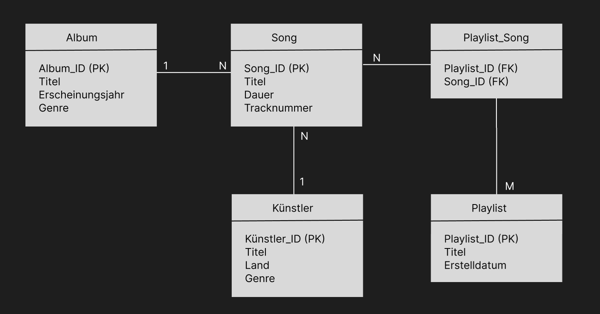
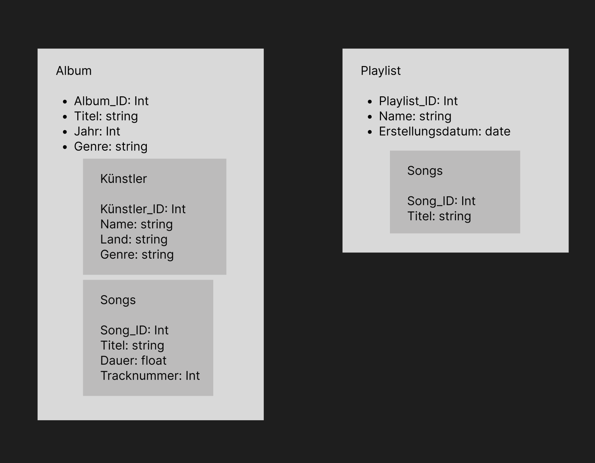

# KN02

## Erklärung der Beziehungen:
Album – Song (1:N)
Ein Album kann mehrere Songs enthalten.
Jeder Song gehört genau zu einem Album.

Künstler – Album (1:N)
Ein Künstler kann mehrere Alben veröffentlichen.
Jedes Album hat genau einen Künstler.

Playlist – Song (N:M)
Eine Playlist kann mehrere Songs enthalten.
Ein Song kann in mehreren Playlists sein.
Die Zwischentabelle Playlist_Song löst die N:N-Beziehung auf.

## Datenmodell

## Erklärung der Verschachtelungen

Künstler als eingebettetes Dokument im Album
Ein Album gehört genau einem Künstler → Keine separate Collection nötig.
Direkte Abfrage von Künstler-Infos über das Album-Dokument.

Songs als Array im Album
Songs sind direkt einem Album zugeordnet → Kein extra Join nötig.
Effiziente Abfrage aller Songs eines Albums.

Songs als Array in der Playlist
Playlist enthält mehrere Songs → Array ist sinnvoll.
Nur Song_ID & Titel, um Redundanz zu minimieren.